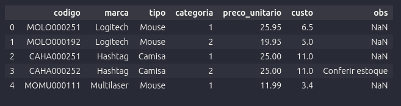
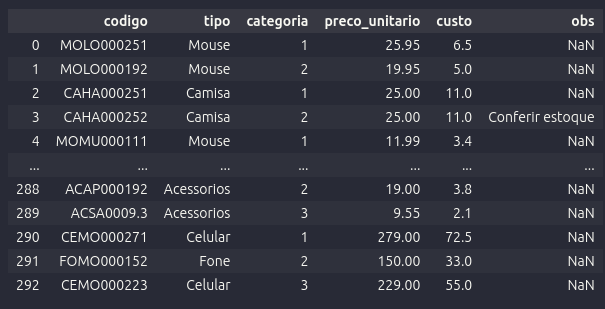

### Buscar Colunas pelo Método Filter

Este é um exemplo de como usar o método `filter` no Pandas para buscar colunas em um DataFrame que contenham a letra "o". Vamos assumir que temos um DataFrame chamado `df` com os seguintes dados:

# Importar biblioteca
import pandas as pd

# Carregando o DataFrame a partir de um arquivo CSV
df = pd.read_csv('produtos.csv')
df.head()

# Aqui está uma visualização do DataFrame inicial:

# Buscando colunas que contêm a letra "o"
df.filter(like='o')

# O resultado será um novo DataFrame contendo apenas as colunas que têm a letra "o" em seus nomes:
